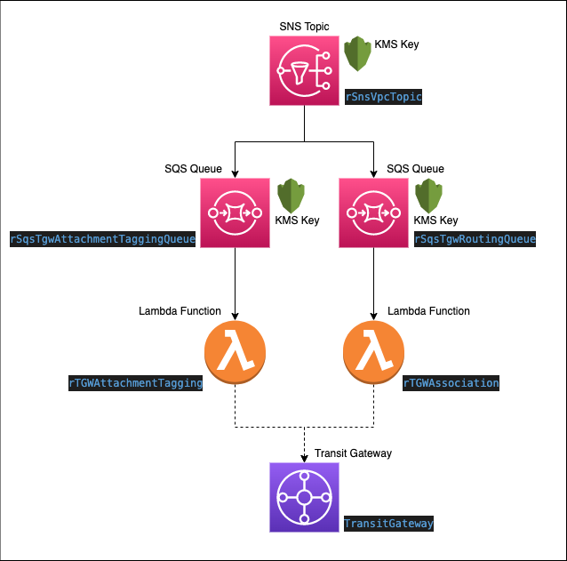
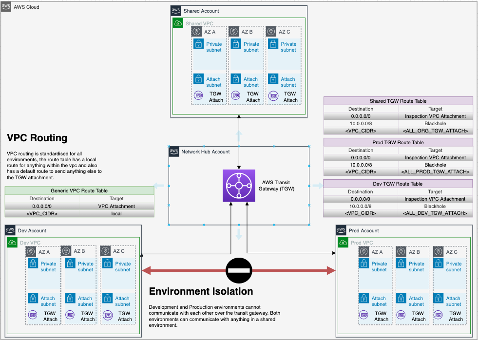

# Account Network Provisioning

## Table of Contents

- [Overview](#overview)
  - [Diagrams](#diagrams)
  - [Useful Links](#useful-links)
- [Prerequisites](#prerequisites)
  - [Variables](#variables)
- [Quick Start](#quick-start)
  - [Deploy from client machine](#deploy-from-client-machine)
  - [Validate Deployment](#validate-deployment)
  - [clean Up](#clean-up)

## Overview
This repository contains SAM, cloudformation, python and bash code to deploy an application used to attach new VPCs to the relevant Transit gateway, including associations and propagations. The resources deployed and the architectural pattern they follow is purely for demonstration/testing  purposes.

Enterprise architecture can include many services combined to achieve a large and secure networks.

The following resources will be deployed:
 - SNS
 - SQS
 - KMS
 - Lambda
 - IAM

### Diagrams

Solution Diagram



Architecture Diagram



### Useful Links
 - https://aws.amazon.com/blogs/architecture/field-notes-how-to-scale-your-networks-on-amazon-web-services/
 - https://aws.amazon.com/blogs/industries/defining-an-aws-multi-account-strategy-for-a-digital-bank/
 - https://aws.amazon.com/blogs/security/protect-your-remote-workforce-by-using-a-managed-dns-firewall-and-network-firewall/
 - https://aws.amazon.com/blogs/architecture/field-notes-working-with-route-tables-in-aws-transit-gateway/
 - https://docs.aws.amazon.com/vpc/latest/tgw/transit-gateway-isolated-shared.html
 - https://aws.amazon.com/blogs/security/simplify-dns-management-in-a-multiaccount-environment-with-route-53-resolver/

-----------------------------------------------------------
## Prerequisites

**Tooling**
 - Python3.8
 - JQ
 - SAM CLI
 - AWS CLI
 - Git CLI
 - CFN-LINT
 - CFN-NAG
 - TaskCat

**Infrastructure**
 - AWS Organization
 - Centralized network account
 - IAM role with required permissions
 - TGW with route tables
 - TGW accept auto attachment enabled
 - S3 bucket to use for SAM to package the fully formed template
 - RAM sharing enabled for the Organization
 ```bash
aws ram enable-sharing-with-aws-organization
```

**Troubleshooting tip**

If you experience any issue with the RAM share disable and re-enable RAM.

```bash
aws organizations disable-aws-service-access --service-principal ram.amazonaws.com
```

- IPAM delegated from the master account to the Centralised network account

```bash
aws ec2 enable-ipam-organization-admin-account \
    --delegated-admin-account-id <Network-Account-ID>
```

 - [Cloudformation template to deploy a TGW with required exports and route tables into central network account.](/templates/tgw.yml)
 - [Cloudformation template to deploy a IPAM.](/templates/ipam.yml)

### Variables

| Parameter Name | Description | Accepted Values |
| -------------- | ----------- | --------------- |
| pOrganizationsId | Organization ID to allow org accounts to publish to SNS topic. | N/A |
| pEnvironment | Environment Type to deploy solution for. | 'CI' 'Dev' 'Test' 'QA' 'Prod' 'HZ-SVC' 'MGMT' |

-----------------------------------------------------------

## Quick Start

### Deploy from client machine

**Set Environment Vars**

Set Change type:
```bash 
export CHANGE_TYPE="CREATE" 
``` 
**or**
```bash 
export CHANGE_TYPE="UPDATE"
```

Set the Environment name, this is used in automation however this relates to the name of the CloudFormation config file name - dev.json example in repository.
```bash
export CI_ENVIRONMENT_NAME=dev
```

Set Commit short SHA to give changeset a unique name.
```bash
export CI_COMMIT_SHORT_SHA=$(git log --pretty=format:'%h' -n 1)
```

Set stack name, template name, S3 bucket name for SAM and region for deployment.
```bash
export STACK_NAME="network-automation-stack"
export TEMPLATE_NAME="template.yml"
export REGION="eu-west-2"
export DEPLOY_BUCKET="<change_bucket_name>"
```

Validate, build and package the SAM template ready for deployment.

```bash
sam validate --region ${REGION}
sam build
sam package --s3-bucket ${DEPLOY_BUCKET} --region ${REGION} --output-template-file ${TEMPLATE_NAME}
```

Create Cloudformation Change-Set.

```bash
aws cloudformation create-change-set \
--stack-name ${STACK_NAME} \
--template-body file://${TEMPLATE_NAME} \
--change-set-name "changeset-${CI_COMMIT_SHORT_SHA}" \
--change-set-type ${CHANGE_TYPE} \
--parameters file://${CI_ENVIRONMENT_NAME}.json \
--capabilities CAPABILITY_NAMED_IAM
```

Execute Change-Set.

```bash
aws cloudformation execute-change-set \
--change-set-name "changeset-${CI_COMMIT_SHORT_SHA}" \
--stack-name ${STACK_NAME}
```

### Validate Deployment

Ensure the Change-Set has successfully completed.

```bash
aws cloudformation describe-stacks \
--stack-name ${STACK_NAME} \
--query Stacks[0].StackStatus --output text
```

Once the changeset has completed successfully, navigate to the AWS console, log in to the network account and check that the application resources were created successfully.

Deploy the [Template](/templates/vpc.yml) into a spoke account, the cloudformation should deploy successfully, navigate to the AWS console, log in to the network account and check that the newly created VPC is attached, associated and propagated correctly.

### Clean Up

To complete the clean up ensure any test VPCs are removed prior to deleting the application stack. Also remove TGW and IPAM stacks from central network account.

```bash
aws cloudformation delete-stack --stack-name ${STACK_NAME}
```